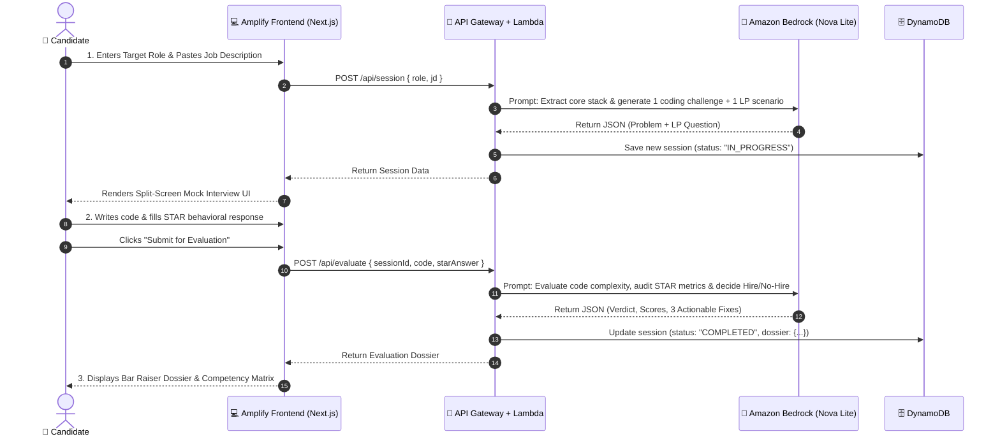

# 🚀 BarRaiser.ai — Master Project Blueprint (48-Hour Build)

> **Hackathon:** Bharat Builds #1: First Commit (WeMakeDevs x AWS)  
> **Track:** Track 2: Deployed, With a URL (`SHIP IT`)  
> **Target Audience:** Engineering students preparing for off-campus Tier-1 product companies and Amazon technical/behavioral rounds.  
> **Team Size:** 2 Developers (48-Hour Sprint)

---

## 1. What's the Problem?

Engineering students spend months solving 300+ LeetCode problems, yet **over 80% fail Tier-1 (Amazon, Google, PhonePe) technical rounds**.

Why?
1. **Zero Real-Time Follow-Up Pressure:** In real technical interviews, interviewers never accept a first solution blindly. They interrupt with edge cases: *"What if the array has duplicates?", "What if memory is capped at 64MB?", "How does this scale to $10^7$ inputs?"* Students freeze because LeetCode never talks back.
2. **The Amazon "Bar Raiser" Blindspot:** Amazon and top tech companies reject candidates who pass coding but fail the **16 Leadership Principles (LPs)**. Students give vague behavioral answers without measurable metrics or a structured **STAR methodology** (Situation, Task, Action, Result).
3. **Information Overload in Job Descriptions:** Off-campus job postings contain 40 bullet points of generic HR buzzwords. Students have 48 hours before an online assessment or interview and have no idea which 3 core topics or patterns to drill.

---

## 2. What's the Existing Solution (and Why Does It Fail)?

| Existing Solution | How It Works | Why It Fails for Students |
| :--- | :--- | :--- |
| **LeetCode / HackerRank** | Static code judge with test cases. | No live interviewer dialogue, no edge-case grilling, and **zero behavioral / Leadership Principle preparation**. |
| **ChatGPT / Generic LLMs** | User prompts: *"Give me 5 mock questions for Amazon SDE-1"*. | Dumps a wall of static text. No code editor, no follow-up interrogation, no persistent progress tracking, and no calibrated **Hire / No-Hire grading**. |
| **Human Mock Platforms** (Pramp, Interviewing.io) | Peer or ex-FAANG human mock interviews. | Prohibitively expensive ($100–$250/session), requires scheduling days in advance, and has high friction for nervous beginners. |

---

## 3. What is Our Solution?

**`BarRaiser.ai`** is an interactive, serverless mock interview copilot that simulates an authentic **Amazon Bar Raiser interview round** in a clean 3-step loop:

1. **Role-Tailored Generation:** Candidate enters target role (e.g. *Amazon SDE-1*) and pastes the Job Description $\rightarrow$ Generates 1 targeted technical coding challenge + 1 Amazon Leadership Principle scenario.
2. **Interactive Mock Round with Follow-Ups:** Candidate writes code in an embedded editor and provides their behavioral STAR response. The AI Bar Raiser reviews the submission and hits them with **1 tough, dynamic follow-up question** (testing edge cases, space/time complexity, or digging deeper into their personal contribution).
3. **The Bar Raiser Debrief Dossier:** Outputs an official Amazon-style hiring calibration report:
   - **Hiring Decision:** `[ Strong Hire | Hire | Lean Hire | No Hire ]`
   - **Amazon LP Scorecard:** (e.g., `Customer Obsession: 4/5`, `Dive Deep: 2/5`)
   - **Technical Correctness:** Time & Space complexity analysis
   - **3 Actionable Fixes:** Concrete weaknesses to patch before the real interview.

---

## 4. Tech Stack & AWS Architecture

```text
┌──────────────────────────────────────────────────────────────┐
│                    AWS Amplify Hosting                       │
│           (Next.js 15 + Tailwind CSS + Lucide Icons)         │
└──────────────────────────────┬───────────────────────────────┘
                               │ HTTPS (REST Calls)
                               ▼
┌──────────────────────────────────────────────────────────────┐
│                  Amazon API Gateway                          │
│         (/api/session  |  /api/evaluate  |  /api/history)    │
└──────────────────────────────┬───────────────────────────────┘
                               │
                               ▼
┌──────────────────────────────────────────────────────────────┐
│                      AWS Lambda                              │
│              (Node.js 20.x or Python 3.12)                   │
└──────────────────────────────┬───────────────────────────────┘
                               │
            ┌──────────────────┴──────────────────┐
            ▼                                     ▼
┌───────────────────────┐             ┌───────────────────────┐
│    Amazon Bedrock     │             │    Amazon DynamoDB    │
│  (Amazon Nova Lite)   │             │   (Single-Table Store │
│  • Sub-2s Latency     │             │    Sessions & Dossier)│
│  • $0.06 / 1M tokens  │             │                       │
└───────────────────────┘             └───────────────────────┘
```

### AWS Architecture Mapping:
* **Compute & API:** **AWS Lambda & Amazon API Gateway**  
  Two clean serverless REST endpoints handling Bedrock prompt orchestration and DynamoDB persistence. Automatically scales to zero with zero server maintenance.
* **AI:** **Amazon Bedrock (Amazon Nova Lite)**  
  Amazon's native multimodal model family. Provides blazing-fast response times (< 2 seconds) and dirt-cheap token costs ($0.06 per 1M input tokens), ensuring free AWS hackathon credits are never exhausted.
* **Database:** **Amazon DynamoDB**  
  Fully managed NoSQL table storing interview sessions, candidate responses, and calibrated Bar Raiser debrief dossiers.
* **Frontend:** **AWS Amplify Hosting**  
  Next.js 15 application connected to Git with automatic CI/CD deployment, custom domain SSL, and Edge CDN distribution, providing the live URL on Day 1.

---

## 5. Methodology & Prompt Engineering Pipeline

The system uses a **2-Stage Evaluation Methodology**:

```text
Stage 1: Tailored Problem Synthesis
[Target Role + JD] ──> Bedrock (Nova Lite) ──> Structured JSON (Coding Problem + Amazon LP Scenario)

Stage 2: Bar Raiser Interrogation & Calibration
[Candidate Code + STAR Answer] ──> Bedrock (Nova Lite) ──>
   ├── Evaluates Code AST & Logic for Edge Cases
   ├── Audits STAR Format (Checks if "Result" has quantifiable metrics)
   └── Synthesizes Calibrated Bar Raiser Dossier (Hire/No-Hire + LP Matrix)
```

1. **System Prompt Grounding:** The LLM is strictly prompted to adopt the persona of an **Amazon Principal SDE & Bar Raiser**. It does not flatter the candidate; it objectively scores against high hiring bars.
2. **Deterministic Structured Output:** All Bedrock responses enforce strict JSON output schemas so the frontend can parse metric cards and verdict badges without regex breakage.

---

## 6. End-to-End Workflow



---

## 7. Input & Output Contracts (Data Schemas)

This is the exact contract between Frontend, Lambda, and DynamoDB.

### Endpoint 1: Start Interview Session
* **Route:** `POST /api/session`
* **Request Input:**
```json
{
  "targetRole": "Amazon SDE-1",
  "jobDescription": "Looking for a backend engineer proficient in Java, Distributed Systems, DynamoDB, and Multi-threading..."
}
```
* **Response Output:**
```json
{
  "sessionId": "sess_98234ab1",
  "codingChallenge": {
    "title": "LRU Cache with TTL Eviction",
    "difficulty": "Medium",
    "description": "Design and implement a data structure for a Least Recently Used (LRU) cache that also supports Time-To-Live (TTL)...",
    "starterCode": "// Java 21\nclass LRUCache {\n    public LRUCache(int capacity) {\n    }\n}"
  },
  "leadershipPrinciple": {
    "principle": "Customer Obsession & Bias for Action",
    "question": "Tell me about a time you had to make a critical engineering trade-off to unblock a customer issue without waiting for full data."
  }
}
```

---

### Endpoint 2: Evaluate & Generate Bar Raiser Dossier
* **Route:** `POST /api/evaluate`
* **Request Input:**
```json
{
  "sessionId": "sess_98234ab1",
  "submittedCode": "class LRUCache { HashMap<Integer, Node> map; ... }",
  "codeLanguage": "java",
  "starAnswer": {
    "situation": "Our payment service was dropping 5% of webhooks during peak sales.",
    "task": "I needed to stabilize throughput within 4 hours.",
    "action": "I introduced an in-memory queue and deferred secondary audit logs.",
    "result": "Dropped packet rate fell to 0.01% with zero financial discrepancies."
  }
}
```
* **Response Output:**
```json
{
  "sessionId": "sess_98234ab1",
  "verdict": "Lean Hire",
  "summary": "Strong technical intuition on hash map caching. Behavioral answer demonstrated Bias for Action but lacked customer impact verification.",
  "technicalEvaluation": {
    "timeComplexity": "O(1) get and put",
    "spaceComplexity": "O(Capacity)",
    "edgeCasesIdentified": "Handled TTL expiration on get, but missed background thread eviction."
  },
  "leadershipScorecard": [
    { "principle": "Customer Obsession", "score": 4, "feedback": "Good focus on payment success." },
    { "principle": "Dive Deep", "score": 2, "feedback": "Did not specify how discrepancies were audited." },
    { "principle": "Bias for Action", "score": 5, "feedback": "Fixed issue within the 4-hour critical window." }
  ],
  "actionableFixes": [
    "Clarify concurrency thread-safety in your Java caching methods using ConcurrentHashMap.",
    "Quantify the financial scale of the transaction volume in your STAR Result section.",
    "Address memory leak mitigation when keys expire but are never accessed again."
  ]
}
```

---

### DynamoDB Table Schema (`BarRaiserSessions`)

* **Partition Key (`PK`):** `sessionId` (String)
* **Attributes:**
  * `createdAt`: ISO timestamp
  * `targetRole`: String
  * `codingProblem`: Map
  * `lpQuestion`: Map
  * `candidateCode`: String
  * `candidateSTAR`: Map
  * `verdict`: String (`Strong Hire`, `Hire`, `Lean Hire`, `No Hire`)
  * `dossier`: Map

---

## 8. Key Features (What the Judges Will See)

1. **Tailored Problem Generator:** Instantly diffs a real Job Description against technical competencies instead of generating generic LeetCode copies.
2. **Dual-Track Evaluation (Tech + Behavioral):** Tests both code correctness and the candidate's Amazon Leadership Principles in one cohesive session.
3. **STAR Method Auditor:** Specifically checks if the candidate provided quantifiable metrics in their behavioral response.
4. **Calibrated Bar Raiser Dossier:** Generates an authentic hiring debrief with metric cards, score breakdowns, and 3 high-priority study action items.
5. **Session History:** Candidates can view past interview runs and track improvement over time.

---

## 9. 48-Hour Division of Labor (Team of Two)

```text
┌──────────────────────────────────────────────┐  ┌──────────────────────────────────────────────┐
│     Person 1: Frontend & UX Lead             │  │     Person 2: Backend & AWS Cloud Lead       │
├──────────────────────────────────────────────┤  ├──────────────────────────────────────────────┤
│ • Setup Next.js 15 on AWS Amplify Hosting    │  │ • Setup DynamoDB table (BarRaiserSessions)   │
│ • Screen 1: Role & JD Input Form             │  │ • Setup AWS Lambda functions                 │
│ • Screen 2: Split Mock Interview Workspace   │  │ • Hook Amazon Bedrock Nova Lite SDK calls    │
│ • Screen 3: Bar Raiser Dossier & Metric Cards│  │ • Setup Amazon API Gateway REST routes       │
│ • Past Sessions History drawer / modal       │  │ • Test Bedrock JSON prompts & error handling │
└──────────────────────────────────────────────┘  └──────────────────────────────────────────────┘
```

---

*This master document is maintained in [`Bharat_Builds/PROJECT_BLUEPRINT.md`](file:///C:/Souvik/Obsidian/Bharat_Builds/PROJECT_BLUEPRINT.md) and indexed in [`Brain.md`](file:///C:/Souvik/Obsidian/Brain.md).*
